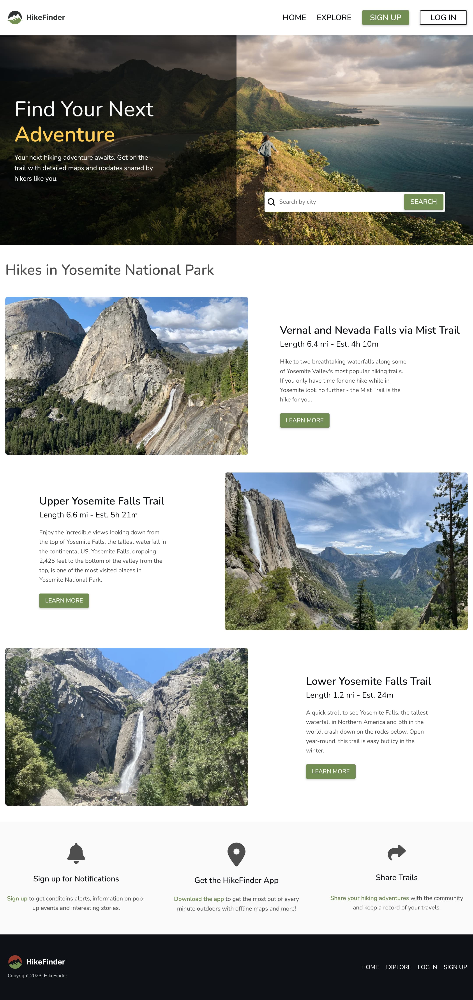

# Hike Finder - A Solo Project from the Scrimba Bootcamp

This is a solution to the Hike Finder multi-page responsive website project from [Scrimba](https://www.scrimba.com). The project is part of Scrimba's Frontend Web Developer Bootcamp program.

## Table of contents

- [Overview](#overview)
  - [The challenge](#the-challenge)
  - [Screenshot](#screenshot)
  - [Links](#links)
- [My process](#my-process)
  - [Built with](#built-with)
  - [What I learned](#what-i-learned)
  - [Continued development](#continued-development)
  - [Useful resources](#useful-resources)
- [Author](#author)
- [Acknowledgments](#acknowledgments)


## Overview

### The challenge

Users should be able to:

- Example: View the optimal layout for the interface depending on their device's screen size
- Example: See hover and focus states for all interactive elements on the page

Additional customization and enhancements

- Updated design, typography, layout
- Use of HTML dialog element to create dynamic modal forms
- Symantic forms with basic client-side form validation

Future enhancements:

- Add additional content for hike details, linked from 'Learn More' buttons
- Add embedded map asset for Explore page


### Screenshot




### Links

- [Scrimba Scrim](https://scrimba.com/scrim/c3aD3Duy)
- [Live Site](https://chipper-clafoutis-3cae74.netlify.app/)

## My process

### Built with

- Semantic HTML5 markup
- CSS custom properties
- Flexbox
- CSS Grid
- Vanilla JavaScript


### What I learned

Continued experience with CSS Grid and Flexbox. 

#### Results section - home page

Given this section is intended to simulate a list of search results, it seemed important semantically to make this an unordered list. There were a couple of approaches I considered for the layout of this section. On larger screens, the design comp indicates that the list should alternate image/content orientation, producing an overlapping effect. 

At first look at the design comp, it seemed like Grid was the best option to produce the offset layout of each result item. However, once I began experimenting, I settled on Flexbox as the cleaner, more efficient solution. I simply needed to allow the images within each list item to grow naturally and proportionately and utilize the nth-of-type pseudo-class to target my elements and do the flip with the order property.

```css
.home-result-item:nth-of-type(2n) .result-img-container {
  order: 1;
}
```

I've used the dialog element a couple of times now, but this is probably the most robust implementation in my projects so far. Since there are no frameworks or libraries involved here, to simplify the creation of the sign-up and login form modals, and to keep the hard-coded HTML to a minimum, I used some straightforward JavaScript, including conditionals and template literals to construct the HTML. A portion of the renderDialogModal function is below:

```js
  let title, emailType, passwordType, submitButton, accountStatus, passwordAutocomplete; // initialize variables for modal content
  // Check if generating signup or login modal
  if (modal === 'signup') {
    // assign variables
    title = 'Sign up';
    emailType = 'new-email';
    passwordType = 'new-password';
    submitButton = 'Sign Up';
    accountStatus = `Already have an account? <a href="#" data-modal="login">Login</a>`;
    passwordAutocomplete = 'new-password';
  }
```

### Continued development

This relatively simple 2-page website ended up with what I'm pretty sure is the most total CSS I've ever written from scratch. Honestly, it's bloated and I'm certain I have a lot of repeated code and inefficient class usage througout the file. This is a product of both poor planning at the beginning of the project and of having worked on it on-and-off over the course of 2-plus months. Things got lost in the build process as I went back and revised a given technique or switched up a design. In the future, I'll want to take a thorough look and prune the repetitive code and tighten up the CSS. This is actually a good project to revise with Sass, which I may end up doing. 

Moving forward, I'll take the lesson of planning out my CSS better and documenting throughout to create a more efficient, modular system.

### Useful resources

- [evilmartians.com](https://evilmartians.com/chronicles/html-best-practices-for-login-and-signup-forms) - This is a great reference when building login and sign-up forms, one I drew from for this project when building my simulated authentication forms.


## Author

- Website - [mattpahuta.com](https://www.mattpahuta.com)
- LinkedIn - [LinkedIn](www.linkedin.com/in/mattpahuta)